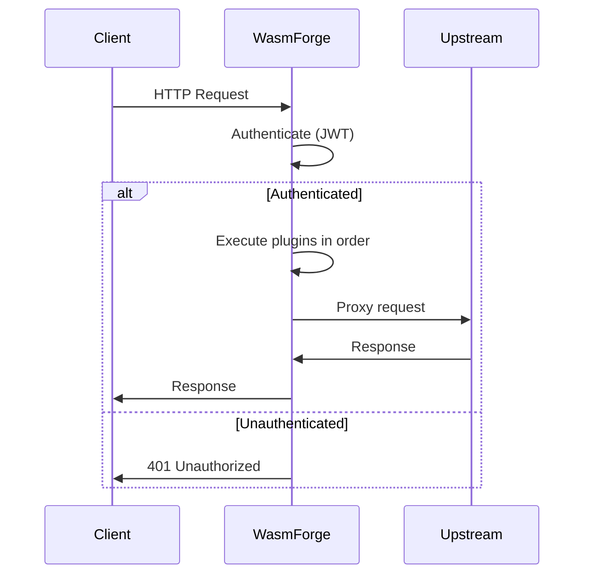

# WasmForge

[](https://github.com/mikhail5545/wasmforge/actions/workflows/ci.yml)
[](https://go.dev/)
[](https://www.apache.org/licenses/LICENSE-2.0)
[](https://webassembly.org/)
[](https://nextjs.org/)

Programmable API gateway with native auth and safe WASM extension points.

WasmForge gives a route-first gateway, a built-in control plane, and a 
constrained WebAssembly middleware model. Native gateway code owns identity, keys,
proxying, and operational controls; plugins handle the custom request logic
that should be easy to version and replace.

## Project Overview

The project combines a Go reverse proxy, admin API, Next.js admin panel, native JWT 
authentication, route-level method policies, and versioned
WebAssembly plugins. Operators define stable gateway responsibilities
once, then attach small WASM modules where APIs need custom behaviour.

The central design choice is a clear trust boundary. Auth validation, token issuance, key lookup, 
and private-key operations are native gateway responsibilities. Plugins
can inspect verified identity context and request data, but they
do not receive direct access to database internals, signing material, or
the admin storage layer.

## Why WasmForge?

The gateway is intentionally split between native platform duties and
replaceable extension logic.

### Native security boundary

Auth validation, token issuance, key lookup, and private-key operations
stay in gateway-owned code.

### Route-first operations

Routes own upstream targets, method policy, authentication, plugin order,
and transport tuning in one explicit model.

### WASM where it helps

Teams can ship request shaping, early rejection, partner routing
hints, and custom policy logic as versioned middleware.

### Automatable control plane

Admin UI workflows map to JSON API endpoints, so manual
setup and pipeline-driven configuration use the same primitives.

## Request flow



## Installation and quick start

### Prerequisites

- Go 1.25+
- Node.js 18+
- `make` (optional, but recommended)

### 1. Download the code

```bash
git clone https://github.com/mikhail5545/wasmforge.git
cd wasmforge
```

or using docker:

```bash
docker pull mikhailkulik:wasmforge:latest
```

### 2. Build

Build the gateway binary, admin UI and embed the UI assets into the binary with one command.

With Make:

```bash
make build
```

or manually:

```bash
bash scripts/build.sh
```
on Windows:

```powershell
powershell scripts\build.ps1
```

### 3. Run

```bash
./bin/wasmforge
```

on Windows:

```powershell
.\bin\wasmforge.exe
```

### 4. Open the dashboard

Go to:

```text
http://localhost:8080
```

From there, you can create routes, upload WASM plugins, and attach plugins to routes.

## Command line arguments and defaults

```bash
-a, --admin-port int                                 Port for the admin server (default 8080)
      --auth-encryption-1password-integration string   Integration name reported to the 1Password SDK (default "wasmforge")
      --auth-encryption-1password-reference string     1Password secret reference for the auth encryption master key
      --auth-encryption-1password-token-env string     Environment variable containing the 1Password service account token (default "OP_SERVICE_ACCOUNT_TOKEN")
      --auth-encryption-aws-kms-key-id string          AWS KMS key ID or ARN for auth encryption
      --auth-encryption-aws-kms-region string          AWS region for the auth encryption KMS key
      --auth-encryption-master-key-env string          Environment variable containing the local auth encryption master key (default "WASMFORGE_AUTH_MASTER_KEY")
      --auth-encryption-provider string                Auth key encryption provider (local, 1password, or aws-kms) (default "local")
  -c, --certs-uploads-dir string                       Directory for uploaded TLS certificates (default "./certs")
  -s, --console-log-level string                       Case-insensitive log level for console output (debug, info, warn, error) (default "debug")
  -f, --file-log-level string                          Case-insensitive log level for file output (debug, info, warn, error) (default "info")
  -h, --help                                           Show this help message
      --log-files                                      Enable logging to files (default true)
  -l, --logs-dir string                                Directory for log files (default "./logs")
  -p, --plugins-uploads-dir string                     Directory for uploaded WASM modules (default "./uploads")
  -t, --use-timestamps                                 Use timestamps in logs filenames (default true)
```

### Example argument usage

For example, to run the gateway with the admin server on port 9090, debug-level file logging, and logs stored in `/tmp/logs`:

```bash 
./bin/wasmforge --admin-port 9090 \
  --logs-dir /tmp/logs \
  --file-log-level debug
```

```bash 
docker run -p 9090:9090 mikhailkulik:wasmforge \
  --admin-port 9090 \
  --logs-dir /tmp/logs \
  --file-log-level debug
```

## Auth encryption configuration

Please note that **encryption configuration options are required**, so you should provide necessary arguments or
environment variables for the auth encryption provider you choose.

New DB-backed private keys are envelope-encrypted. WasmForge
generates a per-key data encryption key, encrypts the PEM with
AES-256-GCM, wraps the data key through the configured provider, and
stores only ciphertext and metadata. 
By default, it uses a local master key provided 
via an environment variable (which is not recommended, use only in early testing stages),
but it also supports integrations with 1Password 
and AWS KMS for more secure key management. Note that if you are using the 1Password 
integration, master key will be actually available in the process memory.
This happens because secret will be resolved at startup and stored in a variable for encryption operations,
but it will not be stored on disk or in the admin storage in any form. The most secure 
option is to use AWS KMS, which performs encryption and decryption operations within 
the KMS service and never exposes the plaintext master key to the gateway process.

Using default local 32-byte master key (not recommended for production):

```bash
export WASMFORGE_AUTH_MASTER_KEY=$(head -c 32 /dev/urandom | base64)
./bin/wasmforge
```

Using 1Password integration:

```bash
export OP_SERVICE_ACCOUNT_TOKEN=your_1password_service_account_token
./bin/wasmforge \
  --auth-encryption-provider 1password \
  --auth-encryption-1password-integration wasmforge \
  --auth-encryption-1password-reference "op://MyVault/AuthSecrets/WasmForgeMasterKey"
```

Using AWS KMS (recommended for production):

```bash
./bin/wasmforge \
  --auth-encryption-provider aws-kms \
  --auth-encryption-aws-kms-key-id us-east-1 \
  --auth-encryption-aws-kms-region alias/wasmforge-auth
```

#### All documentation with more examples is available right in the admin UI in the "Documentation" section.

## Issues and feedback

If you encounter any issues, feel free to open an issue on the GitHub repository

## Project status

WasmForge is actively evolving. See:

- [CONTRIBUTING.md](./CONTRIBUTING.md) for contribution workflow
- [ROADMAP.md](./ROADMAP.md) for planned improvements
